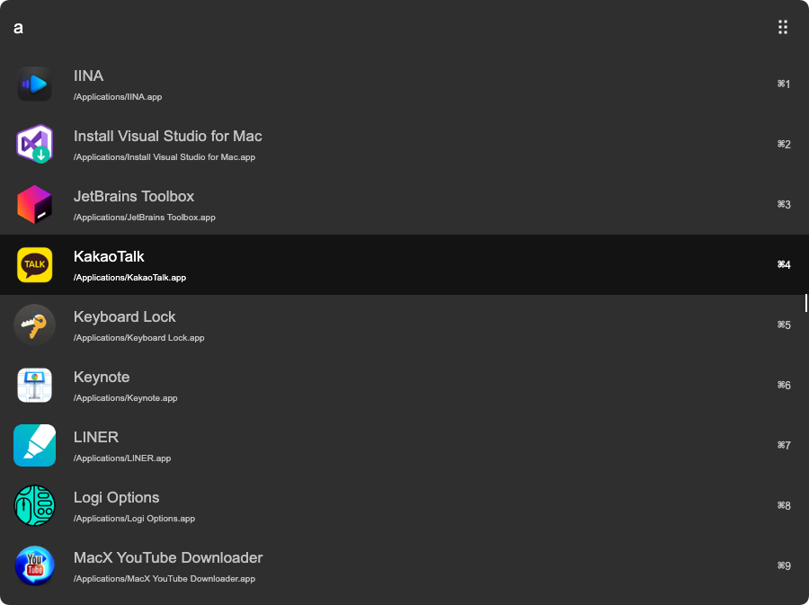
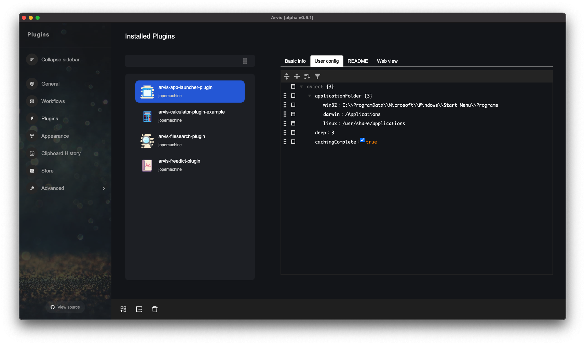

# arvis-app-launcher-plugin
[](https://www.codefactor.io/repository/github/jopemachine/arvis-app-launcher-plugin)
[](http://badge.fury.io/js/arvis-app-launcher-plugin)
[](http://badge.fury.io/js/arvis-app-launcher-plugin)
[](https://lbesson.mit-license.org/)
[](http://makeapullrequest.com)
[](https://GitHub.com/jopemachine/arvis-app-launcher-plugin/issues/)

Cross platform app launcher plugin for [Arvis](https://github.com/jopemachine/arvis)

Demo on mac: 




## Installation

1. Install by npm

```
$ npm i -g arvis-app-launcher-plugin
```

2. Cache program icons by typing below command in Arvis. 

(Only supported on `mac` currently)

```
@cache/arvis-app-launcher-plugin
```


## Config

You can edit this plugin's config on `User config table` like below.



And type `@cache/arvis-app-launcher-plugin` to cache icon images (mac os only)

### applicationFolders

type: `object`

default value: 

* windows: [`C:\\ProgramData\\Microsoft\\Windows\\Start Menu\\Programs`]

* macos: [`/Applications`]

* linux: [
    `/usr/share/applications`,
    `/usr/local/share/applications`,
    `/var/lib/snapd/desktop/applications/`,
    `/var/lib/flatpak/exports/share/applications/`,
    `~/.local/share/applications/`
]

Change the path you want to assign to explore.

If this plugin doesn't work properly, need to check this path exists.

### deep

type: `number`

default value: `3`

Sets the depth to explore

In macos, it is fixed by `1` to avoid to explore in App file.

### concurrency

type: `number | undefined`

default value: `os.cpus().length`

Specifies the number of cpu to use to explore.

## Icon sources

This plugin uses below icon sources

<a target="_blank" href="https://icons8.com">Image</a> icon by <a target="_blank" href="https://icons8.com">Icons8</a>

## Related

- [fast-glob](https://github.com/mrmlnc/fast-glob) - API for this module.

- [arvish](https://github.com/jopemachine/arvish) - Arvis workflow, plugin creator tools

- [other plugins](https://github.com/jopemachine/arvis/blob/master/documents/plugin-links.md)

## To do

- [ ] Write application icon caching logic. It depends on OS.

* macos (O)
* windows (X)
* linux (X)
